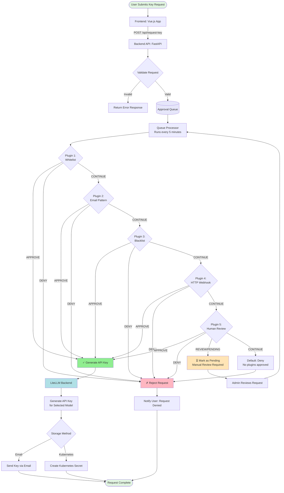

# LLM Key Requestor

A comprehensive LLM API key management system that streamlines the process of requesting, approving, and distributing API keys for multiple LLM providers through a configurable approval workflow.

## Purpose

**LLM Key Requestor** provides a centralized solution for managing LLM API key requests in organizations. It combines:

- **User-Friendly Interface**: A clean Vue.js web application where users can select their preferred LLM model and request access keys
- **Flexible Approval Workflows**: A plugin-based approval system that supports multiple decision-making strategies (whitelists, blacklists, email patterns, HTTP webhooks, human review)
- **LiteLLM Integration**: Seamless integration with LiteLLM for multi-provider key generation and management
- **Automated Processing**: Background queue processor that evaluates requests based on configured approval rules
- **Multiple Delivery Methods**: Support for email delivery or Kubernetes secret storage

This system is ideal for organizations that need to:
- Control and audit LLM API key distribution
- Implement custom approval workflows based on business rules
- Provide self-service access to multiple LLM providers
- Integrate LLM access management with existing infrastructure

## Installation

### Docker Installation

#### Quick Start with Docker Compose

1. Clone the repository:
```bash
git clone https://github.com/vosiander/llm-key-requestor.git
cd llm-key-requestor
```

2. Create a `.env` file with your configuration:
```bash
cp .env.example .env
# Edit .env with your API keys and settings
```

3. Start all services:
```bash
docker-compose up -d
```

The application will be available at:
- Frontend: http://localhost:5173
- Admin Panel: http://localhost:5174
- Backend API: http://localhost:8000
- LiteLLM: http://localhost:4000

#### Individual Container Deployment

**Backend:**
```bash
docker run -d \
  -p 8000:8000 \
  -v $(pwd)/backend/config.yaml:/app/config.yaml \
  -e LITELLM_BASE_URL=http://litellm:4000 \
  -e LITELLM_API_KEY=your-api-key \
  ghcr.io/vosiander/llm-key-requestor/backend:latest
```

**Frontend:**
```bash
docker run -d \
  -p 5173:5173 \
  -e VITE_API_URL=http://localhost:8000 \
  ghcr.io/vosiander/llm-key-requestor/frontend:latest
```

### Helm Installation

Install using the Helm chart available at https://vosiander.github.io/helm-charts:

```bash
# Add the Helm repository
helm repo add vosiander https://vosiander.github.io/helm-charts
helm repo update

# Install the chart
helm install llm-key-requestor vosiander/llm-key-requestor

# Or with custom values
helm install llm-key-requestor vosiander/llm-key-requestor \
  --set backend.config.litellm.base_url=http://litellm:4000 \
  --set backend.config.litellm.api_key=your-api-key
```

**Custom Values Example (values.yaml):**
```yaml
backend:
  image:
    tag: latest
  config:
    litellm:
      base_url: "http://litellm:4000"
      api_key: "your-api-key"
    approval:
      queue_interval: "5m"
    approval_plugins:
      - name: whitelist
        config:
          list:
            - "ollama/*"
            - "llama-*"

frontend:
  image:
    tag: latest
  env:
    VITE_API_URL: "http://backend-service:8000"
```

For advanced configuration options, visit the [Helm chart repository](https://github.com/vosiander/helm-charts).

## Admin Panel

The admin panel provides a web interface for administrators to manage key requests with the following features:

- **Secure Authentication**: HTTP Basic Auth using credentials from environment variables
- **Request Management**: View and filter requests by status (pending, in-review, all)
- **Approval Actions**: Approve or deny requests with optional reasons
- **Real-time Updates**: Dashboard updates with latest request information

### Accessing the Admin Panel

1. Navigate to http://localhost:5174 (when running with Docker Compose)
2. Login with credentials (default: admin/change-me-in-production)
3. View and manage key requests from the dashboard

### Admin Authentication

Admin credentials are configured via environment variables or config.yaml:

**Environment Variables:**
```bash
ADMIN_USERNAME=admin
ADMIN_PASSWORD=your-secure-password
```

**Config File (backend/config.yaml):**
```yaml
admin:
  username: "admin"
  password: "change-me-in-production"
```

**IMPORTANT**: Always change the default admin password in production!

### Admin API Endpoints

The backend provides the following admin endpoints (all require authentication):

- `POST /api/admin/verify` - Verify admin credentials
- `GET /api/admin/requests?filter={pending|review|all}` - List key requests
- `GET /api/admin/requests/{request_id}` - Get request details
- `POST /api/admin/requests/{request_id}/approve` - Approve a request
- `POST /api/admin/requests/{request_id}/deny` - Deny a request with reason

## Approval Process

The system uses a queue-based approval workflow with configurable plugins that evaluate requests sequentially:



### Plugin Evaluation Logic

Plugins are evaluated in the order defined in your configuration. Each plugin returns one of these decisions:

- **APPROVE** ✓ - Immediately approves the request, bypassing remaining plugins
- **DENY** ✗ - Immediately denies the request, bypassing remaining plugins
- **CONTINUE** → - Passes evaluation to the next plugin in the chain
- **REVIEW/PENDING** ⏳ - Marks request for manual review by an administrator
- **Default Behavior**: If all plugins return CONTINUE, the request is denied

## Backend Configuration

The backend is configured via a YAML file (`backend/config.yaml`). Here's a comprehensive example:

```yaml
# LiteLLM Backend Configuration
litellm:
  base_url: "http://localhost:4000"  # Can be overridden by LITELLM_BASE_URL env var
  api_key: ""                         # Can be overridden by LITELLM_API_KEY env var
  enable_litellm_models: true         # Fetch models dynamically from LiteLLM

# Available LLM Models (shown in the frontend)
models:
  - id: "openai-gpt4"
    title: "OpenAI GPT-4"
    icon: "simple-icons:openai"
    color: "#412991"
    description: "Advanced reasoning and problem-solving with extended context."

  - id: "claude-3"
    title: "Claude 3 (Anthropic)"
    icon: "simple-icons:anthropic"
    color: "#D4A574"
    description: "Strong reasoning and analysis capabilities."

  - id: "gemini-pro"
    title: "Google Gemini Pro"
    icon: "simple-icons:google"
    color: "#4285F4"
    description: "Multimodal AI for text, code, and reasoning tasks."

# Approval Queue Configuration
approval:
  queue_interval: "5m"  # How often to process the queue (e.g., "30s", "1m", "5m")

# Approval Plugins (evaluated in order)
approval_plugins:
  # Whitelist Plugin: Auto-approve specific model patterns
  - name: whitelist
    config:
      list:
        - "ollama/*"      # Approve all Ollama models
        - "llama-*"       # Approve all Llama models

  # Email Plugin: Approve/deny based on email domain
  - name: email
    config:
      pattern: "*@example.com"  # Only approve requests from example.com

  # Blacklist Plugin: Deny specific model patterns
  - name: blacklist
    config:
      list:
        - "grok/*"        # Deny all Grok models

  # HTTP Plugin: Query external service for approval
  - name: http
    config:
      endpoint: "https://api.example.com/approve"
      # The endpoint receives POST with: {"email": "...", "model": "...", "request_id": "..."}
      # Expected response: {"decision": "APPROVE|DENY|CONTINUE"}

  # Human in the Loop: Send email for manual approval
  - name: humanintheloop
    config:
      email: "admin@example.com"
      patterns:
        - "claude*"       # Require human approval for Claude models
        - "gpt-4*"        # Require human approval for GPT-4 models
```

### Environment Variables

Override configuration values using environment variables:

```bash
# LiteLLM Configuration
LITELLM_BASE_URL=http://litellm:4000
LITELLM_API_KEY=sk-your-key-here
ENABLE_LITELLM_MODELS=true

# Approval Configuration
APPROVAL_QUEUE_INTERVAL=5m

# Application Settings
CONFIG=/app/config.yaml
PYTHONUNBUFFERED=1
```

## Architecture

### Components

**Frontend:**
- Framework: Vue.js 3 with Composition API
- UI Library: Vuetify 3
- Styling: Tailwind CSS
- Build Tool: Vite
- Internationalization: Vue I18n (English, German, Spanish)

**Backend:**
- Framework: FastAPI
- Package Manager: UV (modern Python package manager)
- Key Features:
  - RESTful API with automatic OpenAPI documentation
  - Background queue processor for approval workflows
  - Plugin-based approval system
  - Email service integration
  - Kubernetes secret management
  - LiteLLM integration

**Infrastructure:**
- LiteLLM: Multi-provider LLM proxy and key management
- PostgreSQL: Database for LiteLLM (optional)
- Docker & Kubernetes: Container orchestration

## API Endpoints

### `GET /`
Health check - returns API status

### `GET /health`
Detailed health check with component status

### `POST /api/request-key`
Submit a key request

**Request Body:**
```json
{
  "llm": "openai-gpt4",
  "email": "user@example.com"
}
```

**Response:**
```json
{
  "message": "Key request received and queued for approval",
  "success": true,
  "request_id": "req_abc123xyz"
}
```

### `GET /docs`
Interactive API documentation (Swagger UI)

### `GET /redoc`
Alternative API documentation (ReDoc)

## Development

### Frontend Development

```bash
cd frontend
npm install
npm run dev
```

The frontend will be available at http://localhost:5173

**Build for production:**
```bash
npm run build
```

### Backend Development

```bash
cd backend
uv sync
uv run python main.py
```

The backend API will be available at:
- API: http://localhost:8000
- Interactive docs: http://localhost:8000/docs
- Alternative docs: http://localhost:8000/redoc

**Run with auto-reload:**
```bash
uv run uvicorn main:app --reload --host 0.0.0.0 --port 8000
```

### Running Tests

```bash
# Backend tests
cd backend
uv run pytest

# Frontend tests
cd frontend
npm run test
```

## CI/CD

GitHub Actions workflows automatically build and push Docker images to GitHub Container Registry (ghcr.io) on:
- Pushes to `main` branch
- Git tags (e.g., `v1.0.0`)
- Pull requests (build only, no push)

### Workflows

- **Frontend**: `.github/workflows/frontend-docker.yml`
- **Backend**: `.github/workflows/backend-docker.yml`

Both workflows support semantic versioning and automatically tag images with:
- Branch name
- Git SHA
- Semantic version tags (for tagged releases)

## Troubleshooting

### Common Issues

**Queue processor not running:**
- Check logs: `docker logs llm-key-requestor-backend`
- Verify `approval.queue_interval` in config.yaml
- Ensure background tasks are enabled

**LiteLLM connection failed:**
- Verify `LITELLM_BASE_URL` points to correct endpoint
- Check if LiteLLM service is running: `curl http://localhost:4000/health`
- Validate `LITELLM_API_KEY` if authentication is required

**Plugins not working:**
- Verify plugin configuration in config.yaml
- Check plugin order (first matching decision wins)
- Review logs for plugin evaluation results

**Kubernetes secrets not created:**
- Ensure service account has correct RBAC permissions
- Verify namespace configuration
- Check Kubernetes API connectivity

## License

Apache License 2.0 - see [LICENSE](LICENSE) file for details.

## Contributing

Contributions are welcome! Please feel free to submit a Pull Request.

## Support

For issues and questions:
- GitHub Issues: https://github.com/vosiander/llm-key-requestor/issues
- Documentation: https://github.com/vosiander/llm-key-requestor
